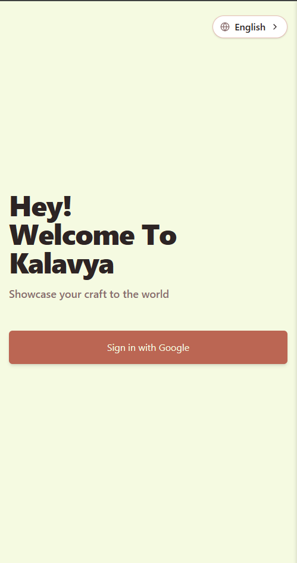
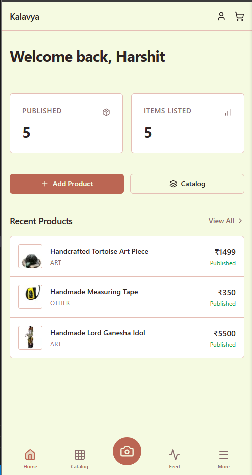
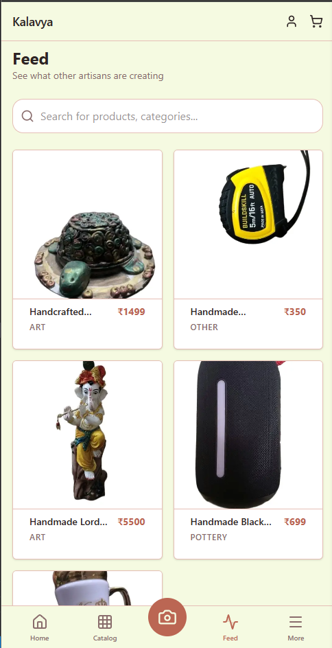
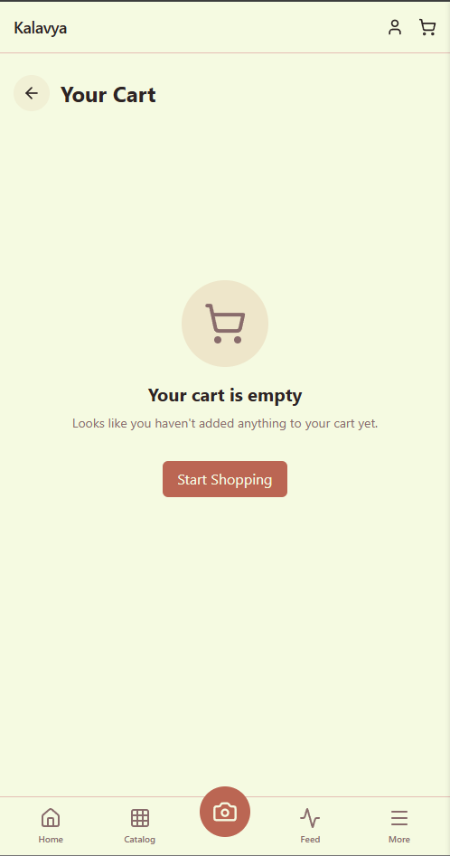
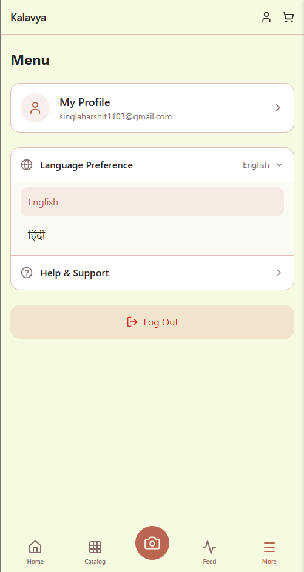
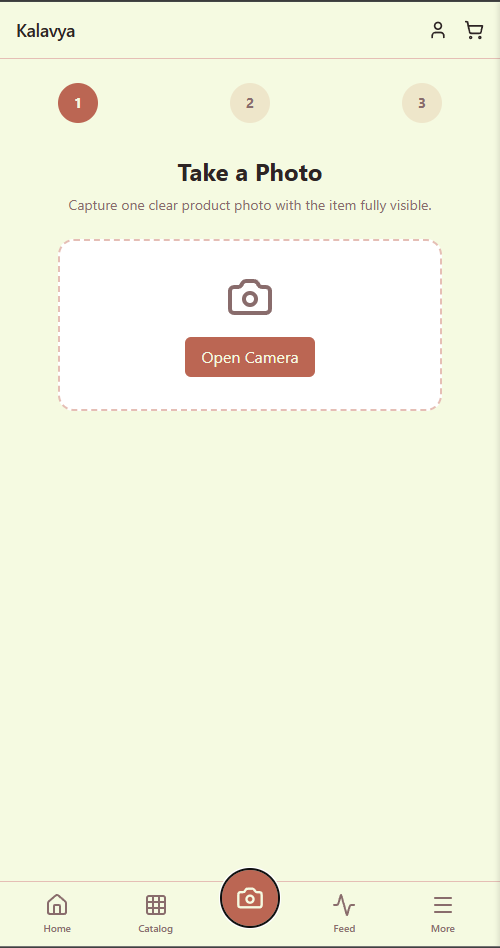
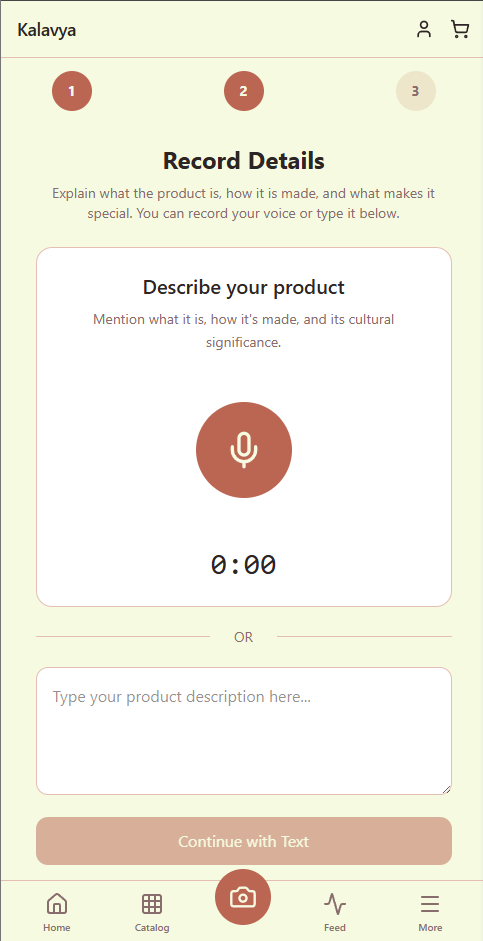
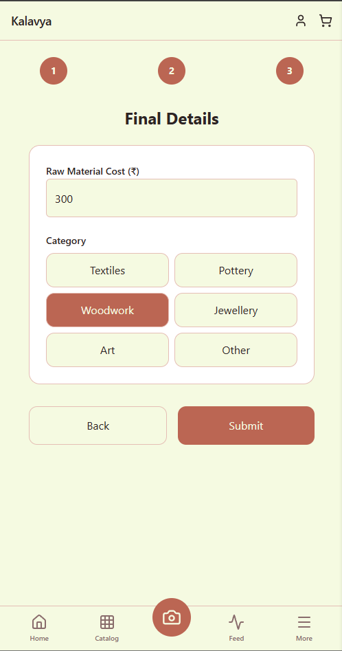
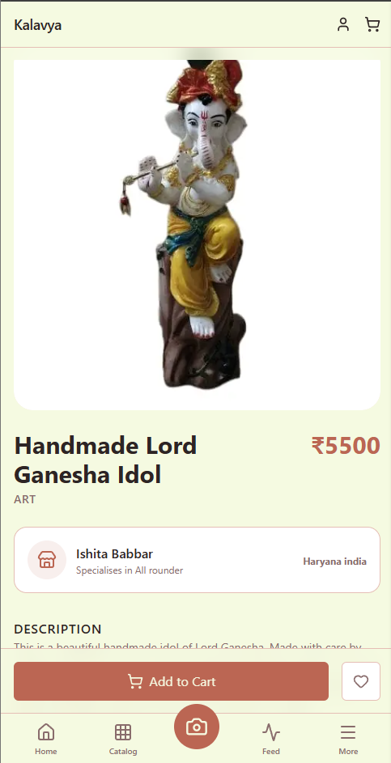

# 🎨 Kalavya (SIH PS 26090)

**An AI-driven Progressive Web App (PWA) empowering rural Indian artisans to list, price, and sell their handmade goods online with zero typing.**

[Features](#-key-features) • [Screenshots](#-screenshots) • [Architecture](#-architecture--tech-stack) • [User Journey](#-user-journey) • [Future Scope](#-future-scope)

---

## 🛑 The Problem

Rural artisans create incredible, high-quality handmade goods, but they struggle to participate in the digital economy (e-commerce, GeM, ONDC) due to three massive barriers:
1. **Digital Literacy:** Typing complex product descriptions and navigating intricate upload forms is intimidating.
2. **Language Barrier:** E-commerce heavily relies on SEO-optimized English, which many rural artisans do not speak.
3. **Market Ignorance (Pricing & Presentation):** Artisans often underprice their goods or take poorly lit photos, severely hurting their market positioning.

## 💡 Our Solution: AI-First Cataloging

Instead of forcing the artisan to become a digital marketer, our app acts as their personal AI agent. 
The artisan simply takes a photo of their product and speaks into their microphone in their native language (e.g., *"This is a hand-painted clay pot, the materials cost me 50 rupees"*).

The **AI Orchestration Pipeline** takes over:
1. **Cloudinary AI** instantly removes the cluttered background and corrects the lighting.
2. **Groq Whisper AI** transcribes the local language voice note lightning fast.
3. **Gemini / Mistral AI** analyzes the image and the transcript to generate a professional, SEO-friendly English & Hindi description, and calculates a fair market retail price based on the visual craftsmanship and raw material cost.

---

## ✨ Key Features

### 👨‍🎨 For Artisans
- **Zero-Typing Onboarding:** Voice-based cataloging with native language support.
- **AI Image Processing:** Automatic background removal and enhancement using Cloudinary.
- **Smart Pricing Engine:** Vision-capable LLMs calculate fair market retail prices based on visual craftsmanship and input material cost.
- **Bilingual SEO Listings:** Auto-generated professional descriptions in English and Hindi.
- **Dashboard Management:** Simple interface to manage drafts, review AI-generated listings, and publish products.
- **Offline Capabilities (PWA):** Installable progressive web app saving space and working under flaky network conditions.

### 🛍️ For Customers
- **Intuitive Browsing Feed:** Clean, visually appealing feed to discover authentic handmade goods.
- **Product Details:** Detailed insights into the craftsmanship and materials of each product.
- **Cart System:** Seamless cart management for purchasing selected items.

---

## 📸 Screenshots

  <table>
    <tr>
      <td align="center"><b>Login Screen</b></td>
      <td align="center"><b>Artisan Dashboard</b></td>
      <td align="center"><b>Market Feed</b></td>
      <td align="center"><b>Shopping Cart</b></td>
      <td align="center"><b>Change Language</b></td>
    </tr>
    <tr>
      <td align="center"></td>
      <td align="center"></td>
      <td align="center"></td>
      <td align="center"></td>
      <td align="center"></td>
    </tr>
    <tr>
      <td align="center"><b>Product Capture</b></td>
      <td align="center"><b>AI Voice Details</b></td>
      <td align="center"><b>Listing Review</b></td>
      <td align="center"><b>Product Details</b></td>
    </tr>
    <tr>
      <td align="center"></td>
      <td align="center"></td>
      <td align="center"></td>
      <td align="center"></td>
  </table>

---

## 🏗 Architecture & Tech Stack

| Technology | What it does | Why we chose it |
| :--- | :--- | :--- |
| **Next.js (App Router)** | Full-stack framework | Seamless React frontend and serverless API backend in a single repository. |
| **Tailwind CSS 4** | Styling engine | Rapid, utility-first styling ensuring a professional, responsive look on mobile. |
| **Supabase** | Postgres DB, Auth, & Storage | Real-time backend-as-a-service offering fast file uploads and secure OAuth. |
| **Vercel AI SDK** | AI Orchestration | Unified `generateObject` API for instant fallback architectures between AI providers. |
| **Google Gemini 1.5 Pro** | Core Brain (Vision & LLM) | Best multimodal model to judge craftsmanship from an image and text simultaneously. |
| **Mistral AI** | Fallback Brain | High-speed, cost-effective LLM as an automatic safety net for rate limits. |
| **Cloudinary** | Image Enhancement | Instant background removal and lighting correction trained on e-commerce. |
| **Groq Whisper API** | Voice-to-Text | Lightning-fast open-source Whisper model capable of understanding rural dialects. |
| **Progressive Web App (PWA)**| App Platform | Bypasses app stores; installs directly from the browser for low-end smartphones. |
| **Framer Motion** | UI Animations | Fluid, app-like spring physics and micro-animations for a premium feel. |
| **Zustand** | State Management | Lightweight, fast, and scalable global state management across the app. |

---

## 🚶 User Journey

### The Artisan Flow
1. **Auth & Setup:** Log in via Google OAuth -> Select "I am an Artisan".
2. **Dashboard:** Routed to a private dashboard to manage the catalog.
3. **Capture (Add Product):** 
   - Snap a photo using the native camera.
   - Record a voice note explaining the product.
   - Input the raw material cost.
4. **AI Processing:** Dynamic loading screen orchestrates Cloudinary, Groq Whisper, and AI models.
5. **Review:** Review the bilingual listing and suggested price. Manual edits supported.
6. **Publish:** The product goes live.

### The Customer Flow
1. **Auth & Setup:** Log in via Google OAuth -> Select "I am a Customer".
2. **Feed:** Routed to a public feed to browse all published goods. Complex artisan tools are hidden for a simplified browsing experience.
3. **Cart & Checkout:** Add items to cart and proceed to order.

---

## 🗄️ Core Data Model

**`profiles` Table**
- `id` (uuid, FK to auth.users)
- `name` (text)
- `company_name` (text)
- `phone_number` (text)
- `address` (text)
- `specialised_in` (text)
- `preferred_language` (text)
- `role` (enum: `artisan` | `customer` | `b2b`)

**`products` Table**
- `id` (uuid)
- `user_id` (FK to profiles)
- `title_en` & `title_hi` (text)
- `raw_image_url` & `enhanced_image_url` (text)
- `raw_audio_url` & `transcript` (text)
- `description_en` & `description_hi` (text)
- `category` (text) & `material_cost` (numeric)
- `suggested_price` (numeric) & `price_reasoning` (text)
- `status` (enum: `draft` | `processing` | `ready_for_review` | `published`)

---

## ⚖️ AI Pipeline — Real vs Simulated (Hackathon Context)

| Component | Status | Rationale |
| :--- | :--- | :--- |
| **Image Background Removal** | **Real** | Cloudinary API, high visual demo payoff. |
| **Speech-to-Text (Groq)** | **Real** | Executed live via Groq's Whisper API. |
| **Translation & Descriptions** | **Real** | Executed live via Gemini / Mistral API. |
| **Pricing Suggestion** | **Real** | Calculated live using a vision-capable LLM analyzing the enhanced image + description + material cost baseline. |
| **Marketplace Connection** | **Simulated** | No accessible public API for GeM without formal onboarding. Updates internal DB catalog. |

> **⚠️ Known Risks & Demo Fallbacks:** 
> - **Live AI call failure:** `try/catch` fallback from Gemini to Mistral API.
> - **Flaky wifi:** UI explicitly shows the loading stage (e.g., "Uploading media...") rather than freezing.
> - **Cloudinary Rate Limits:** Graceful fallback to passing the raw unedited photo to the AI.

---

## 🔮 Future Scope (Production Ready)

While this MVP proves the core AI cataloging engine, a full production launch would include:
- **Real Marketplace Integration:** Connecting the "Publish" button directly to the ONDC Network or Government e-Marketplace (GeM) APIs.
- **Offline-First Sync:** Using IndexedDB to allow artisans to take photos and record audio *without internet*, queuing uploads for when they reach a cellular network.
- **Live Buyer Chat:** Integrating WhatsApp Business API so buyers can message artisans directly, with real-time AI translation bridging the gap.
- **Integrated Logistics:** Auto-calculating shipping costs via IndiaPost APIs based on the artisan's pin code.
- **Multi-user Roles:** Adding a portal for cluster coordinators managing multiple artisans.
- **UI/UX Polish:** Adding success confetti, extended animations, and ensuring a 100/100 Lighthouse PWA score.

---

## 🤝 Contributing

Contributions are always welcome!

If you'd like to improve this project, please read our
[Contributing Guide](./CONTRIBUTING.md) before submitting a Pull Request.

## License

This project is open source and available under the [MIT License](./LICENSE).

---

## Contact Owner
Built by **Harshit Singhal** | BTech CSE | Manav Rachna University

- [Portfolio](https://harshit-singhal.vercel.app)
- [LinkedIn](https://linkedin.com/in/harshitsinghal11)

> _Feel free to reach out if you're building something similar or have questions about the implementation._